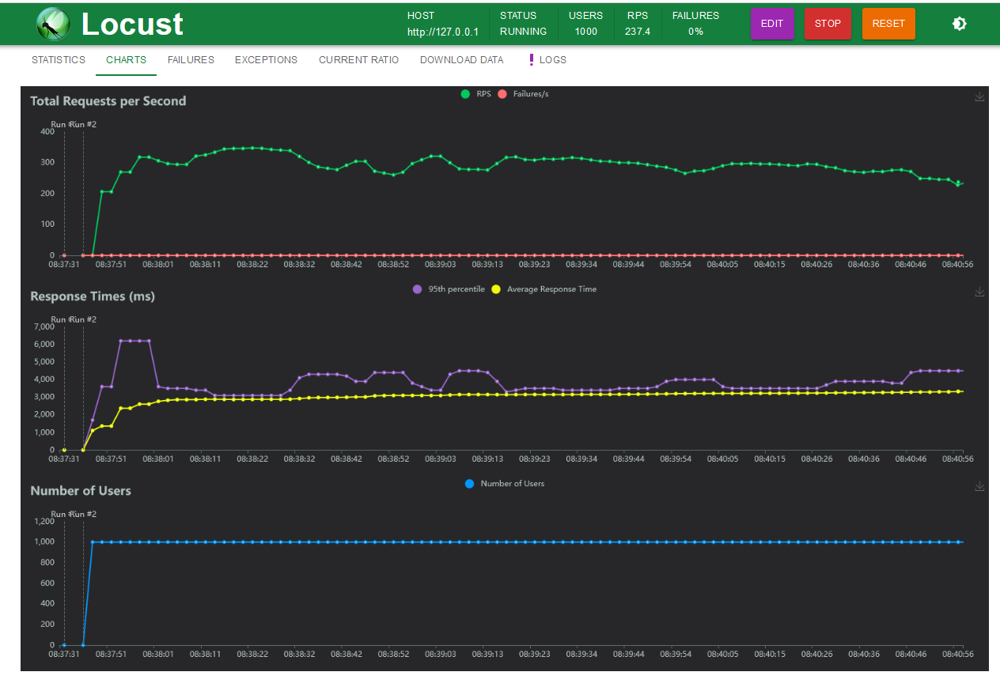

# gateway

Это простой шлюз, который пытается снизить кол-во запросов на сервер-получатель

## Техно-стек

* Python 3.10.11
* Django 4.2
* DRF 3.14.0
* Celery 5.3.4
* Redis 5.0.1
* Gunicorn 21.2.0
* Httpx 0.25.0
* Nginx 1.25

## Locust

[](https://github.com/avnosov3/gateway)


## Запуск проекта
0. Выполните следующие команды
```
git clone git@github.com:avnosov3/gateway.git
```
```
cd SmallShop
```
1. Создайте файл .env. Можно переименовать .env.example в .env
2. Выполните одну из двух команд
```shell
make up
```
```shell
docker compose up -d
```
3. Чтобы остановить проект - выполните одну из двух команд
```shell
make downv
```
```shell
docker compose down -v
```

## Пути, доступные после запуска проекта

1. [Swager](http://localhost/api/v1/swagger/)
2. [Flower](http://localhost/flower/)


## Celery

Celery задача перенаправляет запрос на сервер-получатель.
```
CELERY_RETRY_ATTEMPTS=5  # количество попыток
CELERY_WAITING_TIME_BEFORE_NEW_ATTEMPTS=30  # время (секунды) ожидания между попыткам
EIGTH_PER_SECOND='8/s'  # 8 запросов в секунду
```
В [Flower](http://localhost/flower/) можно посмотреть статус выполнения задачи


## Locust запуск
1. Выполните следующие команды
```
cd tests
```
```
locust
```
или
```shell
make locust
```

2. Локуст будет доступен тут [locust](http://localhost:8089/?tab=charts)

## Команды автоматизации

1. Поднять проект и пересобрать образы
```shell
make upb
```

2. Поднять проект
```shell
make up
```

3. Остановить проект и очистить volume
```shell
make downv
```

4. Остановить проект
```shell
make down
```

5. Запустить сервер локально
```shell
make run
```